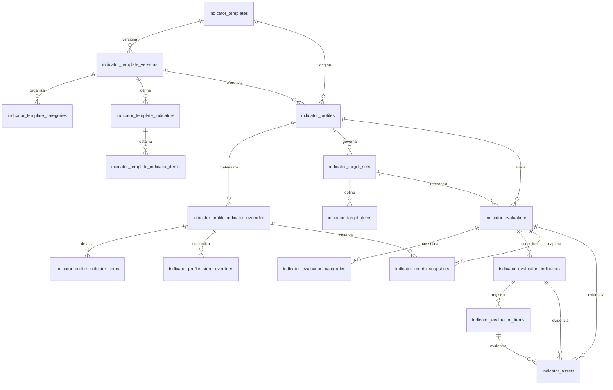

# AGENTS.md - domain/indicators

## Identidade do módulo

- papel: módulo hospedado de indicadores operacionais, comerciais e de qualidade do `plataforma-api`
- status: ativo em implantação inicial

## Responsabilidades

- governança de templates globais de indicadores com versionamento e publicação
- bootstrap do perfil ativo do tenant a partir do template sistêmico `indicators_default`
- configuração do perfil ativo com pesos, itens, evidências e origem dos indicadores
- override opcional por loja para indicadores habilitados no perfil
- gestão de metas por período e por indicador, com recorte opcional por unidade
 gestão de metas por período e por indicador, com recorte opcional por loja canônica do shell
- registro de avaliações com snapshot imutável de configuração aplicada no momento da coleta
- consolidação de dashboard por cliente, por loja e por indicador
- ingestão de snapshots de providers externos ou híbridos
- registro de intents de upload de assets de evidência ligados à avaliação
- publicação de sinais realtime por tenant para sincronizar configuração, operação e dashboard

## Contratos que consome

- obrigatórios:
  - `ActorContext`: `claims.Subject` do JWT autenticado
  - `TenantContext`: `claims.TenantID` ou tenant resolvido por `clientId` quando o ator é root
  - `AccessPolicy`: auth do shell aplicada no grupo protegido de `/core`
  - `PersistenceProvider`: PostgreSQL via `pgxpool` e schema `indicators`
  - `Clock`: `time.Now().UTC()` para timestamps, freshness e envelopes realtime
  - `TenantDirectory`: leitura de `platform_core.tenants` para resolver tenant UUID, `legacy_id` e nome do cliente
  - `UnitsDirectory`: leitura de `platform_core.tenant_stores` para compor visão por loja; `tenant_store_charges` fica apenas como overlay financeiro do shell
- opcionais:
  - `RealtimePublisher`: `internal/realtime.Hub` para broadcast tenant-scoped
  - `MetricsProvider`: qualquer integração externa que publique snapshots no contrato de `indicator_metric_snapshots`
  - `AssetStorage`: integração futura para trocar o intent placeholder de assets por upload direto assinado

## Contratos que exporta

- service methods públicos:
  - `ResolveRealtimeTenant`
  - `ResolveEvaluationRealtimeTenant`
  - `GetGovernanceOverview`
  - `UpdateGovernancePolicy`
  - `ListTemplates`
  - `GetTemplate`
  - `CreateTemplate`
  - `UpdateTemplate`
  - `GetActiveProfile`
  - `ReplaceActiveProfile`
  - `GetStoreOverride`
  - `ReplaceStoreOverride`
  - `ListEvaluations`
  - `GetEvaluation`
  - `CreateEvaluation`
  - `DeleteEvaluation`
  - `GetDashboard`
  - `GetTargets`
  - `ReplaceTargets`
  - `IngestProviderSnapshots`
  - `CreateAssetUploadIntent`
- DTOs públicos para:
  - dashboard consolidado
  - catálogo e detalhe de templates
  - perfil ativo e stores configuradas
  - metas por período
  - listagem e detalhe de avaliações
  - providers e saúde de integração
  - intent de upload de asset
- handlers HTTP hospedados em `/core/modules/indicators/v1`
- envelope realtime tenant-scoped com:
  - `entity = indicators`
  - `action = created | updated | deleted`
  - `clientId`
  - `payload`
  - `timestamp`

## Protocolo de integração

- entrada: `HTTP + JSON` autenticado pelo shell em `/core/modules/indicators/v1`
- saída: DTOs leves para lista, DTOs próprios para detalhe e snapshots de dashboard
- realtime: broadcast via `Hub.BroadcastTenant(tenantID, envelope)`
- regra: root pode operar tenant alheio via `clientId`; ator comum usa sempre o tenant do JWT
- regra: template global continua sendo contrato canônico, mas o perfil ativo do tenant é materializado em tabelas próprias para permitir override e snapshot estável
- regra: a borda nunca consulta tabela interna de outro módulo de negócio para calcular score histórico; o histórico depende apenas do snapshot salvo

## Persistência sob responsabilidade do módulo

- schema: `indicators`
- tabelas:
  - `indicator_governance_policies`
  - `indicator_governance_roadmap_items`
  - `indicator_templates`
  - `indicator_template_versions`
  - `indicator_template_categories`
  - `indicator_template_indicators`
  - `indicator_template_indicator_items`
  - `indicator_profiles`
  - `indicator_profile_indicator_overrides`
  - `indicator_profile_indicator_items`
  - `indicator_profile_store_overrides`
  - `indicator_provider_bindings`
  - `indicator_target_sets`
  - `indicator_target_items`
  - `indicator_evaluations`
  - `indicator_evaluation_categories`
  - `indicator_evaluation_indicators`
  - `indicator_evaluation_items`
  - `indicator_metric_snapshots`
  - `indicator_assets`
- migrations principais:
  - `0020_seed_indicators_module.sql`
  - `0021_backfill_root_active_modules.sql`
  - `0022_indicators_foundation.sql`
  - `0023_indicators_governance.sql`
  - `0024_seed_indicators_default_template.sql`
  - `0025_restore_root_tenant_active.sql`
  - `0033_indicators_store_id.sql`
- índices relevantes:
  - published version única por template
  - perfil ativo único por tenant
  - índices por `tenant_id + status` em perfis, target sets e avaliações
  - índices por `profile_id`, `evaluation_id` e `provider_name + metric_key`
- storage atual:
  - `indicator_assets` registra o intento e a chave lógica do arquivo
  - o presign real ainda é placeholder; não há URL assinada persistida pelo módulo neste estágio

### Desenho lógico do banco

### Regras de persistência já assumidas pelo código

- o perfil ativo do tenant é criado sob demanda quando não existe e depende de uma versão `published` do template `indicators_default`
- update de template trabalha em versão `draft`; publicação arquiva a versão publicada anterior do mesmo template
- replace do perfil ativo é idempotente por `code` do indicador e por `code` do item
- replace de targets substitui integralmente os target sets do perfil ativo
- exclusão de avaliação apaga categorias, indicadores, itens, snapshots e assets via cascata do schema
- snapshots de provider são append-only; saúde do provider é derivada por `MAX(snapshot_at)` e cobertura encontrada
- referências de loja em overrides, metas, avaliações e snapshots usam `store_id` UUID apontando para `platform_core.tenant_stores(id)`
- `unit_code` e `unit_name` permanecem apenas como snapshot/apresentação em avaliações; não são mais a identidade da loja

## Endpoints, filas e interfaces expostas

- `GET /core/modules/indicators/v1/dashboard`
- `GET /core/modules/indicators/v1/dashboard/stores`
- `GET /core/modules/indicators/v1/governance`
- `PATCH /core/modules/indicators/v1/governance/policies/{policyId}`
- `GET /core/modules/indicators/v1/templates`
- `GET /core/modules/indicators/v1/templates/{templateId}`
- `POST /core/modules/indicators/v1/templates`
- `PATCH /core/modules/indicators/v1/templates/{templateId}`
- `GET /core/modules/indicators/v1/profiles/active`
- `PUT /core/modules/indicators/v1/profiles/active`
- `GET /core/modules/indicators/v1/profiles/active/stores/{storeId}`
- `PUT /core/modules/indicators/v1/profiles/active/stores/{storeId}`
- `GET /core/modules/indicators/v1/evaluations`
- `GET /core/modules/indicators/v1/evaluations/{evaluationId}`
- `POST /core/modules/indicators/v1/evaluations`
- `DELETE /core/modules/indicators/v1/evaluations/{evaluationId}`
- `GET /core/modules/indicators/v1/targets`
- `PUT /core/modules/indicators/v1/targets`
- `POST /core/modules/indicators/v1/providers/snapshot`
- `POST /core/modules/indicators/v1/assets/presign`

## Eventos e sinais de integração

- publicados:
  - nenhum evento de domínio formal assíncrono fora do processo no momento
  - sinais realtime tenant-scoped com `entity = indicators` para:
    - `template`
    - `profile`
    - `store`
    - `evaluation`
    - `targets`
    - `providers`
    - `assets`
- consumidos:
  - nenhum evento de domínio formal no momento
  - snapshots externos entram somente por chamada explícita ao endpoint `providers/snapshot`

## O que o módulo não pode conhecer

- tela concreta do painel ou layout específico do Nuxt
- store/composable do frontend
- query direta em tabela operacional de outro domínio para recalcular histórico
- sessão paralela ao shell
- regra interna de cobrança, auth, atendimento-online ou fila-atendimento além do contrato lógico de snapshot/provider
- payloads gigantes de detalhe em endpoints de lista
- storage vendor específico como regra de domínio

## Checks mínimos de mudança

- `go test ./...`
- validar bootstrap do perfil ativo com template `indicators_default` publicado
- validar mutações com broadcast realtime por tenant
- validar lista leve versus detalhe completo em templates e avaliações
- validar replace integral de targets e perfil sem deixar órfãos funcionais
- validar fluxo de cliente root com `clientId` e fluxo tenant comum sem `clientId`

## Observações operacionais do estágio atual

- `0024_seed_indicators_default_template.sql` é pré-requisito funcional do bootstrap do perfil ativo; sem o template sistêmico `indicators_default` publicado, `GetActiveProfile` retorna `ErrBootstrapUnavailable`
- o bootstrap SQL do perfil ativo já foi corrigido para copiar itens do template com aliases consistentes de `indicator_template_indicator_items` e casts explícitos; qualquer ajuste futuro nessa query exige smoke de `profiles/active` e `dashboard`
- o tenant `root` (`legacy_id = 7`) voltou a ficar operacional no runtime local após `0025_restore_root_tenant_active.sql`; o fluxo root com `clientId=7` foi validado novamente em `profiles/active` e `dashboard`
- o painel consome o módulo pela base `/core/modules/indicators/v1`; o host Nuxt deve manter esse prefixo ao usar o proxy `/api/core-bff`
- a exportação real do módulo vive no `painel-web` e depende dos payloads de dashboard e evaluations expostos por este domínio
- `CreateAssetUploadIntent` grava o asset e devolve um intent placeholder com `storageProvider = pending` e `directUploadEnabled = false`
- a saúde de provider é projeção de leitura; o módulo ainda não executa coleta automática agendada
- `indicator_provider_bindings` já pertence ao schema, mas a primeira entrega hospedada usa leitura do perfil e snapshots para compor saúde, sem engine dedicada de binding dinâmico