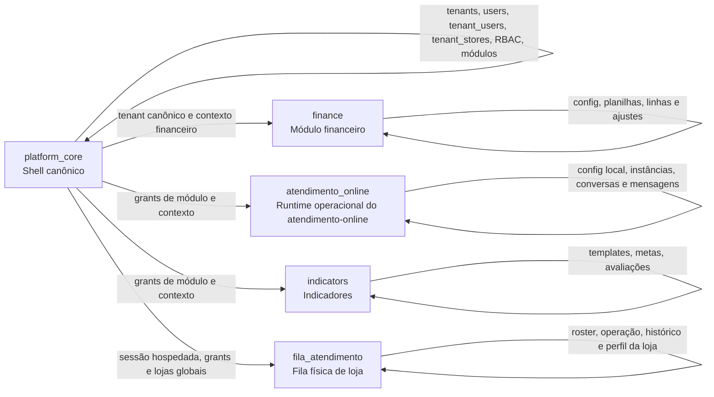
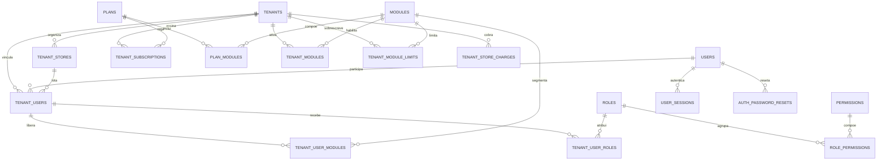
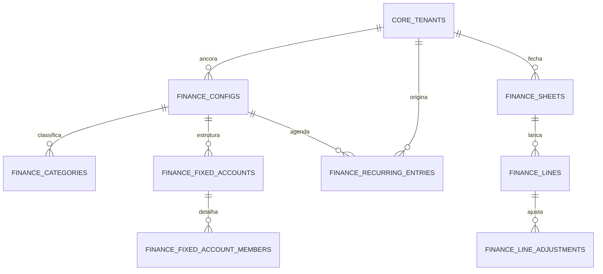
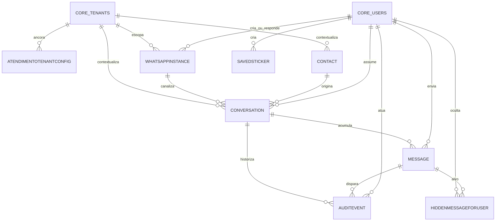
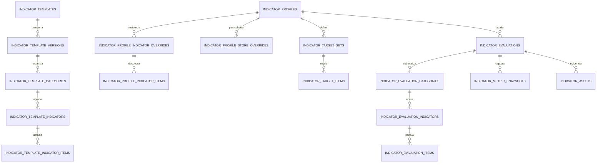
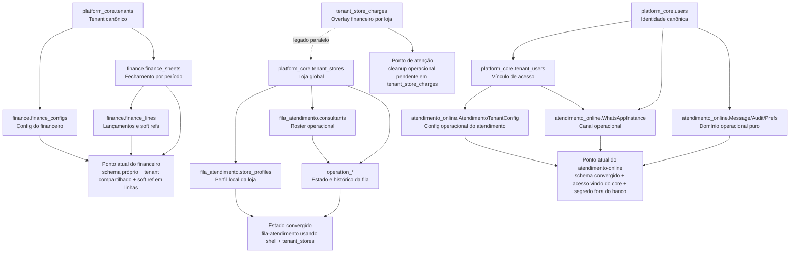

# Diagramas ER Simplificados do Banco Atual

## 1. Visão geral dos schemas ativos

## 2. ER simplificado do `platform_core`

## 3. ER simplificado do `finance`

Leitura: o módulo financeiro saiu do `platform_core`, mas continua usando `platform_core.tenants` como âncora compartilhada. O ownership dos dados financeiros agora é do schema `finance`.

## 4. ER simplificado do runtime operacional hoje hospedado em `atendimento_online`

Leitura: `atendimento_online` já não possui `Tenant` nem `User` físicos. As colunas de tenant e usuário armazenam ids canônicos do core, e as FKs locais restantes conectam apenas o domínio operacional interno.

## 5. ER simplificado do `indicators`

## 6. ER simplificado do `fila_atendimento`

```mermaid
erDiagram
    CORE_TENANTS ||--o{ CONSULTANTS : escopa
    CORE_USERS ||--o| CONSULTANTS : vincula
    CORE_TENANT_STORES ||--|| STORE_PROFILES : complementa
    CORE_TENANT_STORES ||--|| STORE_OPERATION_SETTINGS : configura
    CORE_TENANT_STORES ||--o{ STORE_SETTING_OPTIONS : parametriza
    CORE_TENANT_STORES ||--o{ STORE_CATALOG_PRODUCTS : cataloga
    CORE_TENANT_STORES ||--o{ STORE_CAMPAIGNS : incentiva
    CORE_TENANT_STORES ||--o{ CONSULTANTS : aloja
    CORE_TENANT_STORES ||--o{ OPERATION_QUEUE_ENTRIES : fila
    CONSULTANTS ||--o{ OPERATION_QUEUE_ENTRIES : entra
    CORE_TENANT_STORES ||--o{ OPERATION_ACTIVE_SERVICES : atende
    CONSULTANTS ||--o{ OPERATION_ACTIVE_SERVICES : atende
    CORE_TENANT_STORES ||--o{ OPERATION_PAUSED_CONSULTANTS : pausa
    CONSULTANTS ||--o{ OPERATION_PAUSED_CONSULTANTS : pausa
    CORE_TENANT_STORES ||--o{ OPERATION_CURRENT_STATUS : resume
    CONSULTANTS ||--o{ OPERATION_CURRENT_STATUS : resume
    CORE_TENANT_STORES ||--o{ OPERATION_STATUS_SESSIONS : historiza
    CONSULTANTS ||--o{ OPERATION_STATUS_SESSIONS : historiza
    CORE_TENANT_STORES ||--o{ OPERATION_SERVICE_HISTORY : fecha
    CONSULTANTS ||--o{ OPERATION_SERVICE_HISTORY : fecha
```

## 7. Diagrama dos principais pontos de integração

## 8. Como usar estes diagramas

1. use o diagrama geral para explicar a arquitetura atual do banco em reunião;
2. use o ER do schema específico para revisar ownership de dados e fronteiras do módulo;
3. use o diagrama de integração para discutir o que já convergiu e onde ainda há soft refs ou contratos lógicos entre módulos.
