# Mapeamento Completo do Banco Atual

Data de referência: 2026-04-13

## Objetivo

Este documento consolida o banco atual da plataforma para apoiar:

1. desenho de fluxo de negócio;
2. leitura rápida de entidades e relacionamentos;
3. criação de diagramas ER simples;
4. alinhamento entre shell, operação, indicadores e fila de atendimento.

## Escopo e premissas

Esta análise foi feita a partir das fontes versionadas do repositório, não de um dump ao vivo do PostgreSQL. Portanto:

1. a estrutura foi derivada das migrations, do `schema.prisma`, dos seeds e da documentação canônica versionada;
2. exemplos de registros marcados como `seed real` vêm de seeds presentes no repositório;
3. exemplos marcados como `ilustrativo` respeitam o contrato do schema, mas não representam uma linha confirmada em ambiente;
4. tabelas técnicas como `schema_migrations` foram omitidas do mapeamento de negócio.

## Fontes de verdade usadas

### Shell e core

- `apps/plataforma-api/migrations/0001_core_schema.sql`
- `apps/plataforma-api/migrations/0005_admin_manage_and_pricing.sql`
- `apps/plataforma-api/migrations/0011_add_viewer_access_level.sql`
- `apps/plataforma-api/migrations/0012_finance_module.sql`
- `apps/plataforma-api/migrations/0018_auth_session_settings.sql`
- `apps/plataforma-api/migrations/0019_auth_password_reset.sql`
- `apps/plataforma-api/migrations/0026_admin_user_store_directory.sql`
- `apps/plataforma-api/migrations/0027_add_consultant_access_level.sql`
- `apps/plataforma-api/migrations/0028_normalize_tenant_user_access_levels.sql`

### Operação omnichannel

- `apps/atendimento-online-api/prisma/schema.prisma`
- `apps/atendimento-online-api/prisma/seed.ts`

### Indicators

- `apps/plataforma-api/migrations/0022_indicators_foundation.sql`
- `apps/plataforma-api/migrations/0023_indicators_governance.sql`
- `apps/plataforma-api/migrations/0024_seed_indicators_default_template.sql`

### Fila de atendimento

- `modules/fila-atendimento/backend/internal/platform/database/migrations/0001_init.sql`
- `modules/fila-atendimento/backend/internal/platform/database/migrations/0003_consultants_and_store_settings.sql`
- `modules/fila-atendimento/backend/internal/platform/database/migrations/0005_normalize_store_settings.sql`
- `modules/fila-atendimento/backend/internal/platform/database/migrations/0006_operations.sql`
- `modules/fila-atendimento/backend/internal/platform/database/migrations/0008_store_admin_fields.sql`
- `modules/fila-atendimento/backend/internal/platform/database/migrations/0009_user_invitations.sql`
- `modules/fila-atendimento/backend/internal/platform/database/migrations/0010_user_profile_fields.sql`
- `modules/fila-atendimento/backend/internal/platform/database/migrations/0011_store_terminal_role.sql`
- `modules/fila-atendimento/backend/internal/platform/database/migrations/0012_consultant_user_binding.sql`
- `modules/fila-atendimento/backend/internal/platform/database/migrations/0013_user_password_policy.sql`
- `modules/fila-atendimento/backend/internal/platform/database/migrations/0014_operation_pause_kind.sql`
- `modules/fila-atendimento/backend/internal/platform/database/migrations/0015_shell_bridge_identities.sql`
- `modules/fila-atendimento/backend/internal/platform/database/migrations/0016_store_campaigns.sql`
- `modules/fila-atendimento/backend/internal/platform/database/migrations/0017_user_shell_role_sync_mode.sql`

## Resumo executivo

Hoje o banco de dados funcional da plataforma está distribuído em quatro áreas principais:

| Schema | Dono principal | Papel | Tabelas de negócio |
| --- | --- | --- | ---: |
| `platform_core` | `apps/plataforma-api` | shell, identidade global, tenants, módulos, cobrança, finanças, auth | 30 |
| `public` | `apps/atendimento-online-api` | operação omnichannel de atendimento | 10 |
| `indicators` | `apps/plataforma-api` | templates, perfis, metas, avaliações e governança de indicadores | 20 |
| `fila_atendimento` | `modules/fila-atendimento/backend` | operação de fila, lojas, consultores, campanhas e histórico operacional | 19 |

Total mapeado: 79 tabelas de negócio.

## Leitura arquitetural rápida

1. `platform_core` é o shell canônico da plataforma. Ele decide quem é o usuário, a qual tenant ele pertence, quais módulos estão ativos e quais limites cada tenant possui.
2. `public` mantém a operação omnichannel do módulo `atendimento-online`. Ele ainda possui identidade operacional própria, mas já carrega ponte para o shell por `coreTenantId`, `coreUserId` e `coreTenantUserId`.
3. `indicators` é um schema analítico separado, consumido pelo core, que se apoia em `tenant_id` lógico e não em FKs diretas para `platform_core`.
4. `fila_atendimento` ainda mantém identidade local e escopos locais, mas já possui ponte para o shell por `user_external_identities` e por contratos de sessão/contexto no runtime hospedado.

## Relações entre schemas

As relações entre schemas são majoritariamente lógicas, não por FK cruzada:

1. `public."Tenant".coreTenantId` aponta logicamente para `platform_core.tenants.id`.
2. `public."User".coreUserId` aponta logicamente para `platform_core.users.id`.
3. `public."User".coreTenantUserId` aponta logicamente para `platform_core.tenant_users.id`.
4. `indicators.tenant_id` representa o tenant do shell, mas o schema não cria FK para `platform_core.tenants`.
5. `indicators.evaluator_user_id` e `indicators.uploaded_by_user_id` são UUIDs lógicos do shell, também sem FK.
6. `fila_atendimento.user_external_identities` faz a ponte entre o usuário local do módulo e uma identidade externa do shell.

## Fluxos de negócio derivados do banco

### 1. Provisionamento de cliente no shell

Fluxo base:

`tenants` -> `users` -> `tenant_users` -> `tenant_subscriptions` -> `tenant_modules` -> `tenant_module_limits` -> `tenant_user_modules` -> `tenant_user_roles`

Leitura:

1. o shell cria ou ativa um cliente em `tenants`;
2. cria a identidade global em `users`;
3. vincula a pessoa ao cliente em `tenant_users`;
4. ativa assinatura em `tenant_subscriptions`;
5. liga módulos do cliente em `tenant_modules`;
6. resolve limites em `tenant_module_limits`;
7. libera módulos por usuário em `tenant_user_modules`;
8. distribui papéis RBAC em `tenant_user_roles`.

### 2. Login, sessão e recuperação de senha do painel

Fluxo base:

`users` -> `user_sessions` -> `auth_session_settings` -> `auth_password_resets`

Leitura:

1. `users` guarda a identidade global;
2. `user_sessions` controla sessões e revogação;
3. `auth_session_settings` define TTL por escopo;
4. `auth_password_resets` guarda trilha de recuperação com hash do código e expiração.

### 3. Operação omnichannel do atendimento online

Fluxo base:

`public."Tenant"` -> `public."WhatsAppInstance"` -> `public."Contact"` -> `public."Conversation"` -> `public."Message"` -> `public."AuditEvent"`

Leitura:

1. o tenant operacional existe em `public."Tenant"`;
2. cada instância conectada fica em `public."WhatsAppInstance"`;
3. contatos conhecidos ficam em `public."Contact"`;
4. cada conversa consolida canal, contato, instância e responsável;
5. mensagens inbound e outbound ficam em `public."Message"`;
6. eventos críticos são registrados em `public."AuditEvent"`.

### 4. Gestão financeira por tenant

Fluxo base:

`finance_configs` -> `finance_categories` / `finance_fixed_accounts` / `finance_recurring_entries` -> `finance_sheets` -> `finance_lines` -> `finance_line_adjustments`

Leitura:

1. o tenant recebe uma configuração financeira única em `finance_configs`;
2. categorias, contas fixas, membros de conta fixa e recorrências definem a estrutura;
3. cada mês ou período operacional abre uma planilha em `finance_sheets`;
4. cada planilha recebe linhas de entrada e saída em `finance_lines`;
5. cada linha pode receber ajustes detalhados em `finance_line_adjustments`.

### 5. Gestão de indicadores

Fluxo base:

`indicator_templates` -> `indicator_template_versions` -> `indicator_template_categories` -> `indicator_template_indicators` -> `indicator_template_indicator_items` -> `indicator_profiles` -> `indicator_profile_indicator_overrides` -> `indicator_profile_indicator_items` -> `indicator_target_sets` / `indicator_target_items` -> `indicator_evaluations` / `indicator_evaluation_*` -> `indicator_assets`

Leitura:

1. o módulo nasce com um template versionado;
2. o template organiza categorias, indicadores e itens de coleta;
3. cada tenant cria ou ativa um perfil operacional baseado nesse template;
4. o perfil pode customizar indicadores, itens e até overrides por loja;
5. o tenant define metas em `indicator_target_sets` e `indicator_target_items`;
6. avaliações concretas geram snapshots, notas, evidências e ativos.

### 6. Fila de atendimento por loja

Fluxo base:

`tenants` -> `stores` -> `consultants` -> `store_operation_settings` / `store_setting_options` / `store_catalog_products` / `store_campaigns` -> `operation_queue_entries` -> `operation_active_services` / `operation_current_status` / `operation_paused_consultants` -> `operation_status_sessions` / `operation_service_history`

Leitura:

1. o módulo mantém seu próprio tenant e suas lojas;
2. cada loja possui consultores e papéis locais;
3. a loja possui configuração operacional, catálogos e campanhas;
4. a fila corrente fica em `operation_queue_entries`;
5. o atendimento em andamento fica em `operation_active_services`;
6. o status corrente do consultor fica em `operation_current_status`;
7. pausas ficam em `operation_paused_consultants`;
8. trilhas append-only ficam em `operation_status_sessions` e `operation_service_history`.

## ER simples do banco atual

```mermaid
erDiagram
    PLATFORM_TENANTS ||--o{ PLATFORM_TENANT_USERS : possui
    PLATFORM_USERS ||--o{ PLATFORM_TENANT_USERS : participa
    PLATFORM_TENANTS ||--o{ PLATFORM_TENANT_MODULES : ativa
    PLATFORM_MODULES ||--o{ PLATFORM_TENANT_MODULES : compoe
    PLATFORM_TENANTS ||--o{ PLATFORM_TENANT_SUBSCRIPTIONS : assina
    PLATFORM_TENANTS ||--o{ FINANCE_SHEETS : gera
    FINANCE_SHEETS ||--o{ FINANCE_LINES : contem
    FINANCE_LINES ||--o{ FINANCE_LINE_ADJUSTMENTS : ajusta

    OMNI_TENANT ||--o{ OMNI_USER : possui
    OMNI_TENANT ||--o{ OMNI_INSTANCE : conecta
    OMNI_TENANT ||--o{ OMNI_CONTACT : cadastra
    OMNI_INSTANCE ||--o{ OMNI_CONVERSATION : atende
    OMNI_CONTACT ||--o{ OMNI_CONVERSATION : origina
    OMNI_USER ||--o{ OMNI_CONVERSATION : assume
    OMNI_CONVERSATION ||--o{ OMNI_MESSAGE : acumula
    OMNI_MESSAGE ||--o{ OMNI_AUDIT_EVENT : gera

    IND_TEMPLATE ||--o{ IND_VERSION : versiona
    IND_VERSION ||--o{ IND_CATEGORY : organiza
    IND_CATEGORY ||--o{ IND_INDICATOR : agrupa
    IND_INDICATOR ||--o{ IND_ITEM : detalha
    IND_PROFILE ||--o{ IND_PROFILE_INDICATOR : customiza
    IND_PROFILE_INDICATOR ||--o{ IND_PROFILE_ITEM : desdobra
    IND_PROFILE ||--o{ IND_TARGET_SET : mira
    IND_TARGET_SET ||--o{ IND_TARGET_ITEM : define
    IND_PROFILE ||--o{ IND_EVALUATION : avalia
    IND_EVALUATION ||--o{ IND_EVALUATION_INDICATOR : apura
    IND_EVALUATION_INDICATOR ||--o{ IND_EVALUATION_ITEM : pontua

    FILA_TENANT ||--o{ FILA_STORE : possui
    FILA_USER ||--o{ FILA_USER_STORE_ROLE : atua
    FILA_STORE ||--o{ FILA_CONSULTANT : escala
    FILA_STORE ||--|| FILA_STORE_SETTINGS : configura
    FILA_STORE ||--o{ FILA_QUEUE_ENTRY : fila
    FILA_CONSULTANT ||--o{ FILA_QUEUE_ENTRY : entra
    FILA_CONSULTANT ||--o| FILA_ACTIVE_SERVICE : atende
    FILA_CONSULTANT ||--o| FILA_CURRENT_STATUS : resume
    FILA_CONSULTANT ||--o{ FILA_SERVICE_HISTORY : historiza
```



## Inventário completo por schema

### `platform_core`: shell, comercial, RBAC, auth e finanças

#### Identidade, tenant e RBAC

| Tabela | Papel no negócio | Relações-chave |
| --- | --- | --- |
| `tenants` | cliente da plataforma | 1:N com `tenant_users`, `tenant_subscriptions`, `tenant_modules`, `tenant_store_charges`, `finance_configs` |
| `users` | identidade global do shell | 1:N com `tenant_users`, `user_sessions`, `auth_password_resets`, `tenant_module_pricing` |
| `tenant_users` | vínculo usuário-cliente | N:1 com `tenants` e `users`; recebe `access_level`, `business_role`, `store_id`, `registration_number` |
| `roles` | papéis RBAC | N:1 opcional com `tenants` e `modules`; 1:N com `role_permissions`, `tenant_user_roles` |
| `permissions` | permissões atômicas | N:1 opcional com `modules`; N:N com `roles` via `role_permissions` |
| `role_permissions` | composição papel-permissão | N:1 com `roles` e `permissions` |
| `tenant_user_roles` | papel atribuído ao usuário do tenant | N:1 com `tenant_users` e `roles` |
| `user_sessions` | sessão autenticada do shell | N:1 com `users`; N:1 opcional com `tenants` |
| `auth_session_settings` | TTL de sessão por escopo | referência opcional a `users` por `updated_by_user_id` |
| `auth_password_resets` | recuperação de senha com trilha | N:1 com `users` |
| `audit_logs` | auditoria administrativa do shell | N:1 opcional com `tenants`, `users`, `modules` |
| `presence_connections` | presença/conexões em tempo real | N:1 com `tenants`, `users` e opcionalmente `modules` |

#### Módulos, planos, assinatura e cobrança

| Tabela | Papel no negócio | Relações-chave |
| --- | --- | --- |
| `modules` | catálogo de módulos da plataforma | 1:N com `plan_modules`, `tenant_modules`, `tenant_module_limits`, `tenant_module_pricing` |
| `plans` | catálogo de planos comerciais | 1:N com `plan_modules`, `plan_module_limits`, `tenant_subscriptions` |
| `plan_modules` | módulos habilitados por plano | N:1 com `plans` e `modules` |
| `plan_module_limits` | limites padrão do módulo dentro do plano | N:1 com `plans` e `modules` |
| `tenant_subscriptions` | assinatura ativa do cliente | N:1 com `tenants` e `plans` |
| `tenant_modules` | módulo efetivamente ativado no cliente | N:1 com `tenants` e `modules` |
| `tenant_module_limits` | override de limite por cliente/módulo | N:1 com `tenants`, `modules` e opcionalmente `users` |
| `tenant_user_modules` | módulo liberado por usuário do tenant | N:1 com `tenants`, `tenant_users`, `modules` |
| `tenant_store_charges` | diretório de lojas/custos do cliente para cobrança/admin | N:1 com `tenants`; é alvo do `tenant_users.store_id` |
| `tenant_module_pricing` | precificação customizada por cliente/módulo | N:1 com `tenants`, `modules` e opcionalmente `users` |

#### Financeiro

| Tabela | Papel no negócio | Relações-chave |
| --- | --- | --- |
| `finance_configs` | configuração financeira única por tenant | 1:1 lógico com `tenants`; 1:N com categorias, contas fixas e recorrências |
| `finance_categories` | categorias financeiras do tenant | N:1 com `finance_configs` |
| `finance_fixed_accounts` | contas fixas configuradas | N:1 com `finance_configs`; N:1 opcional com `finance_categories` |
| `finance_fixed_account_members` | rateio/composição da conta fixa | N:1 com `finance_fixed_accounts` |
| `finance_recurring_entries` | recorrências entre tenants | N:1 com `finance_configs`; N:1 com `tenants` por `source_tenant_id` |
| `finance_sheets` | planilha financeira por período | N:1 com `tenants`; 1:N com `finance_lines` |
| `finance_lines` | linha de entrada/saída da planilha | N:1 com `finance_sheets`; soft reference para `finance_fixed_accounts` |
| `finance_line_adjustments` | ajuste detalhado de linha | N:1 com `finance_lines` |

### `public`: operação omnichannel do atendimento-online

Observação importante: por ser Prisma sem `@@map`, as tabelas físicas esperadas no PostgreSQL seguem o nome do model, como `"Tenant"`, `"User"` e `"Conversation"`.

| Tabela/model | Papel no negócio | Relações-chave |
| --- | --- | --- |
| `Tenant` | tenant operacional do atendimento | 1:N com `User`, `Conversation`, `Message`, `AuditEvent`, `SavedSticker`, `Contact`, `HiddenMessageForUser`, `WhatsAppInstance` |
| `User` | usuário operacional do atendimento | N:1 com `Tenant`; 1:N com atribuições, mensagens outbound, auditoria, figurinhas, acessos de instância |
| `WhatsAppInstance` | instância WhatsApp por tenant | N:1 com `Tenant`; N:1 opcional com `User` criador e responsável; 1:N com `Conversation`, `Message`, `WhatsAppInstanceUserAccess` |
| `WhatsAppInstanceUserAccess` | whitelist de acesso do usuário à instância | N:1 com `Tenant`, `WhatsAppInstance` e `User` |
| `SavedSticker` | biblioteca de figurinha reutilizável | N:1 com `Tenant`; N:1 opcional com `User` autor |
| `Contact` | cadastro de contato conhecido | N:1 com `Tenant`; 1:N com `Conversation` |
| `Conversation` | conversa por canal/instância/contato | N:1 com `Tenant`, `WhatsAppInstance`, `User` assignee e `Contact`; 1:N com `Message` e `AuditEvent` |
| `Message` | mensagem inbound/outbound | N:1 com `Tenant`, `Conversation`, `WhatsAppInstance` e opcionalmente `User`; 1:N com `AuditEvent` e `HiddenMessageForUser` |
| `AuditEvent` | trilha operacional da conversa/mensagem | N:1 com `Tenant` e opcionalmente `User`, `Conversation`, `Message` |
| `HiddenMessageForUser` | ocultação individual de mensagem | N:1 com `Tenant`, `User` e `Message` |

### `indicators`: templates, perfis, metas, avaliações e governança

#### Template base e customização

| Tabela | Papel no negócio | Relações-chave |
| --- | --- | --- |
| `indicator_templates` | template mestre do módulo | 1:N com `indicator_template_versions` e `indicator_profiles` |
| `indicator_template_versions` | versão do template | N:1 com `indicator_templates`; 1:N com categorias e indicadores |
| `indicator_template_categories` | agrupador macro do template | N:1 com `indicator_template_versions`; 1:N com `indicator_template_indicators` |
| `indicator_template_indicators` | indicador de alto nível do template | N:1 com `indicator_template_versions` e `indicator_template_categories`; 1:N com itens e bindings |
| `indicator_template_indicator_items` | item de coleta do indicador | N:1 com `indicator_template_indicators` |
| `indicator_profiles` | perfil operacional do tenant | referência lógica a `tenant_id`; N:1 opcional com template e versão |
| `indicator_profile_indicator_overrides` | override/customização por perfil | N:1 com `indicator_profiles`; N:1 opcional com `indicator_template_indicators` |
| `indicator_profile_indicator_items` | item customizado do perfil | N:1 com `indicator_profile_indicator_overrides`; N:1 opcional com `indicator_template_indicator_items` |
| `indicator_profile_store_overrides` | override por loja/unidade | N:1 com `indicator_profiles` e `indicator_profile_indicator_overrides` |
| `indicator_provider_bindings` | binding de métrica externa | aponta para indicador de template ou de perfil |

#### Metas, avaliações e evidências

| Tabela | Papel no negócio | Relações-chave |
| --- | --- | --- |
| `indicator_target_sets` | conjunto de metas por período | N:1 lógico com `tenant_id`; N:1 com `indicator_profiles`; 1:N com `indicator_target_items` |
| `indicator_target_items` | meta detalhada por indicador/unidade | N:1 com `indicator_target_sets`; N:1 opcional com `indicator_profile_indicator_overrides` |
| `indicator_evaluations` | avaliação consolidada por período/unidade | N:1 lógico com `tenant_id`; N:1 com `indicator_profiles`; N:1 opcional com `indicator_target_sets` |
| `indicator_evaluation_categories` | subtotal por categoria na avaliação | N:1 com `indicator_evaluations` |
| `indicator_evaluation_indicators` | resultado por indicador | N:1 com `indicator_evaluations`; N:1 opcional com `indicator_evaluation_categories` e `indicator_profile_indicator_overrides` |
| `indicator_evaluation_items` | resposta/nota do item avaliado | N:1 com `indicator_evaluation_indicators`; N:1 opcional com `indicator_profile_indicator_items` |
| `indicator_metric_snapshots` | snapshot externo de métrica | N:1 opcional com `indicator_evaluations` e `indicator_profile_indicator_overrides` |
| `indicator_assets` | evidência anexada | N:1 lógico com `tenant_id`; N:1 opcional com `indicator_evaluations`, `indicator_evaluation_indicators`, `indicator_evaluation_items` |

#### Governança

| Tabela | Papel no negócio | Relações-chave |
| --- | --- | --- |
| `indicator_governance_policies` | política/global guideline do módulo | catálogo independente |
| `indicator_governance_roadmap_items` | backlog/roadmap de governança | catálogo independente |

### `fila_atendimento`: identidade local, lojas, configuração e operação

#### Identidade e escopo

| Tabela | Papel no negócio | Relações-chave |
| --- | --- | --- |
| `users` | usuário local do módulo | 1:N com papéis, convites e identidades externas |
| `tenants` | tenant local do módulo | 1:N com `stores`, `user_tenant_roles`, `consultants` |
| `stores` | loja/unidade operacional | N:1 com `tenants`; 1:N com papéis de loja, consultores, settings, catálogos, campanhas e operação |
| `user_platform_roles` | papel interno de plataforma do módulo | 1:1 lógico com `users` |
| `user_tenant_roles` | papel no escopo do tenant do módulo | N:1 com `users` e `tenants` |
| `user_store_roles` | papel no escopo da loja | N:1 com `users` e `stores`; suporta `consultant`, `manager`, `store_terminal` |
| `user_invitations` | convite de onboarding com token em hash | N:1 com `users`; N:1 opcional com `users` convidador |
| `user_external_identities` | ponte com identidade externa do shell | N:1 com `users`; guarda `provider`, `external_subject`, `role_sync_mode` |
| `consultants` | roster operacional por loja | N:1 com `tenants`, `stores` e opcionalmente `users` |

#### Configuração da loja

| Tabela | Papel no negócio | Relações-chave |
| --- | --- | --- |
| `store_operation_settings` | configuração escalar da operação | 1:1 com `stores` |
| `store_setting_options` | catálogo tipado de opções | N:1 com `stores` |
| `store_catalog_products` | catálogo de produtos da loja | N:1 com `stores` |
| `store_campaigns` | campanhas que impactam operação/bonificação | N:1 com `stores` |

#### Operação em tempo real e histórico

| Tabela | Papel no negócio | Relações-chave |
| --- | --- | --- |
| `operation_queue_entries` | fila corrente por loja | N:1 com `stores` e `consultants` |
| `operation_active_services` | atendimento atualmente em curso | N:1 com `stores` e `consultants` |
| `operation_paused_consultants` | pausa/atribuição especial corrente | N:1 com `stores` e `consultants`; possui `kind` |
| `operation_current_status` | status resumido atual | N:1 com `stores` e `consultants` |
| `operation_status_sessions` | trilha append-only de status | N:1 com `stores` e `consultants` |
| `operation_service_history` | histórico append-only de atendimento fechado | N:1 com `stores` e `consultants` |

## Exemplos de registros

### 1. `platform_core.tenants` e `platform_core.users` (`seed real`)

```json
{
  "tenant": {
    "slug": "acme-core",
    "name": "ACME",
    "status": "active",
    "contact_email": "admin@acme.local",
    "billing_mode": "single",
    "monthly_payment_amount": 0,
    "require_user_store_link": true,
    "require_user_registration": true,
    "metadata": {
      "bootstrap": "migration_0016"
    }
  },
  "user": {
    "email": "admin@acme.local",
    "name": "Admin ACME",
    "status": "active",
    "is_platform_admin": false,
    "metadata": {
      "bootstrap": "migration_0016"
    }
  },
  "tenant_user": {
    "status": "active",
    "is_owner": true,
    "access_level": "admin",
    "user_type": "admin",
    "business_role": "owner"
  }
}
```

### 2. `platform_core` de assinatura e módulo (`seed real`)

```json
{
  "tenant_subscription": {
    "tenant_slug": "demo-core",
    "plan_code": "pro",
    "status": "active",
    "billing_cycle": "monthly",
    "currency": "BRL"
  },
  "tenant_module": {
    "tenant_slug": "demo-core",
    "module_code": "core_panel",
    "status": "active",
    "source": "plan"
  },
  "tenant_module_limit": {
    "tenant_slug": "acme-core",
    "module_code": "atendimento",
    "limit_key": "instances",
    "limit_value_int": 1,
    "source": "migration_0016"
  }
}
```

### 3. `platform_core.finance_lines` (`ilustrativo`)

```json
{
  "sheet": {
    "title": "Fechamento Abril/2026",
    "period": "2026-04",
    "status": "aberta"
  },
  "line": {
    "kind": "saida",
    "description": "Comissão equipe loja Jardins",
    "category": "Comissoes",
    "effective": true,
    "effective_date": "2026-04-10",
    "amount": 4200.0,
    "details": "Pagamento referente ao fechamento da primeira quinzena"
  },
  "adjustment": {
    "amount": -200.0,
    "note": "Desconto de adiantamento",
    "date": "2026-04-11"
  }
}
```

### 4. `public` do atendimento-online (`seed real`)

```json
{
  "tenant": {
    "slug": "demo",
    "name": "Empresa Demo",
    "whatsappInstance": "demo-instance",
    "maxChannels": 1,
    "maxUsers": 3
  },
  "instance": {
    "instanceName": "demo-instance",
    "displayName": "WhatsApp Demo",
    "isDefault": true,
    "isActive": true
  },
  "conversation": {
    "externalId": "5511999999999@s.whatsapp.net",
    "instanceScopeKey": "demo-instance",
    "channel": "WHATSAPP",
    "contactName": "Cliente Demo",
    "contactPhone": "5511999999999"
  },
  "messages": [
    {
      "direction": "INBOUND",
      "content": "Oi, tudo bem? Quero saber mais sobre o plano.",
      "senderName": "Cliente Demo",
      "status": "SENT"
    },
    {
      "direction": "OUTBOUND",
      "content": "Claro! Posso te explicar as opcoes disponiveis.",
      "senderName": "Admin Demo",
      "status": "SENT"
    }
  ]
}
```

### 5. `indicators` (`seed real`)

```json
{
  "template": {
    "code": "indicators_default",
    "name": "Template padrao de indicadores",
    "status": "active",
    "default_scope_mode": "per_store"
  },
  "category": {
    "code": "ambiente_aconchegante",
    "name": "Ambiente Aconchegante",
    "weight": 15,
    "scope_mode": "per_store"
  },
  "indicator": {
    "code": "time_especialistas",
    "indicator_kind": "composite",
    "source_kind": "hybrid",
    "source_module": "people_analytics",
    "source_metric_key": "team_health"
  },
  "item": {
    "code": "reposicao_cafe",
    "label": "Reposicao de cafe",
    "input_type": "boolean",
    "weight": 25
  }
}
```

### 6. `fila_atendimento` de identidade e loja (`seed real`)

```json
{
  "tenant": {
    "id": "aaaaaaaa-aaaa-aaaa-aaaa-aaaaaaaaaaaa",
    "slug": "tenant-demo",
    "name": "Tenant Demo"
  },
  "store": {
    "id": "bbbbbbbb-bbbb-bbbb-bbbb-bbbbbbbbb001",
    "code": "PJ-RIO",
    "name": "Perola Riomar",
    "city": "Aracaju"
  },
  "user": {
    "email": "consultor@demo.local",
    "display_name": "Consultor Demo",
    "is_active": true
  },
  "consultant": {
    "name": "Thalles",
    "initials": "TH",
    "color": "#168aad",
    "monthly_goal": 140000,
    "commission_rate": 0.025
  }
}
```

### 7. `fila_atendimento.store_campaigns` (`seed real`)

```json
{
  "campaign_id": "campanha-ticket-premium",
  "name": "Ticket premium",
  "campaign_type": "interna",
  "target_outcome": "compra-reserva",
  "min_sale_amount": 5000,
  "bonus_fixed": 50,
  "bonus_rate": 0.005,
  "queue_jump_only": false,
  "existing_customer_filter": "all"
}
```

### 8. `fila_atendimento.operation_service_history` (`ilustrativo`)

```json
{
  "service_id": "svc-2026-04-13-0001",
  "person_name": "Thalles",
  "started_at": 1713013200000,
  "finished_at": 1713014700000,
  "duration_ms": 1500000,
  "finish_outcome": "compra",
  "start_mode": "queue",
  "queue_position_at_start": 1,
  "customer_name": "Maria Souza",
  "customer_phone": "79999998888",
  "products_seen_json": ["COL-PRATA-004"],
  "products_closed_json": ["COL-PRATA-004"],
  "sale_amount": 6200.0,
  "campaign_matches_json": ["campanha-ticket-premium"],
  "campaign_bonus_total": 81.0
}
```

## Pontos de atenção para desenho de fluxo e ER futuro

1. `platform_core.tenants` e `public."Tenant"` coexistem. O shell é a verdade de autorização, mas a operação omnichannel ainda mantém tenant próprio.
2. `platform_core.users` e `public."User"` coexistem. A ponte existe, mas ainda não eliminou a identidade operacional local.
3. `indicators` deliberadamente usa `tenant_id` lógico sem FK; isso facilita isolamento do módulo, mas exige disciplina na camada de serviço.
4. `tenant_users.store_id` referencia `tenant_store_charges.id`, não `fila_atendimento.stores.id`. Hoje não existe uma entidade global única de loja no shell.
5. `fila_atendimento` ainda tem `users` e papéis locais. A ponte com o shell evoluiu, mas o modelo final ainda não convergiu para identidade única.
6. `public."Tenant".evolutionApiKey` segue como campo do tenant operacional, enquanto o desenho alvo já recomenda remover segredo em texto puro do banco principal.

## Conclusão prática

Se o objetivo é desenhar fluxo de negócio e um ER executivo da plataforma, a leitura mais segura é esta:

1. `platform_core` comanda identidade, assinatura, acesso e limites;
2. `public` executa atendimento omnichannel;
3. `indicators` mede desempenho e governança;
4. `fila_atendimento` executa operação física de loja e fila, ainda em transição de identidade.

Esse é o recorte que deve servir de base para os próximos diagramas, workshops de processo e especificação de integrações.