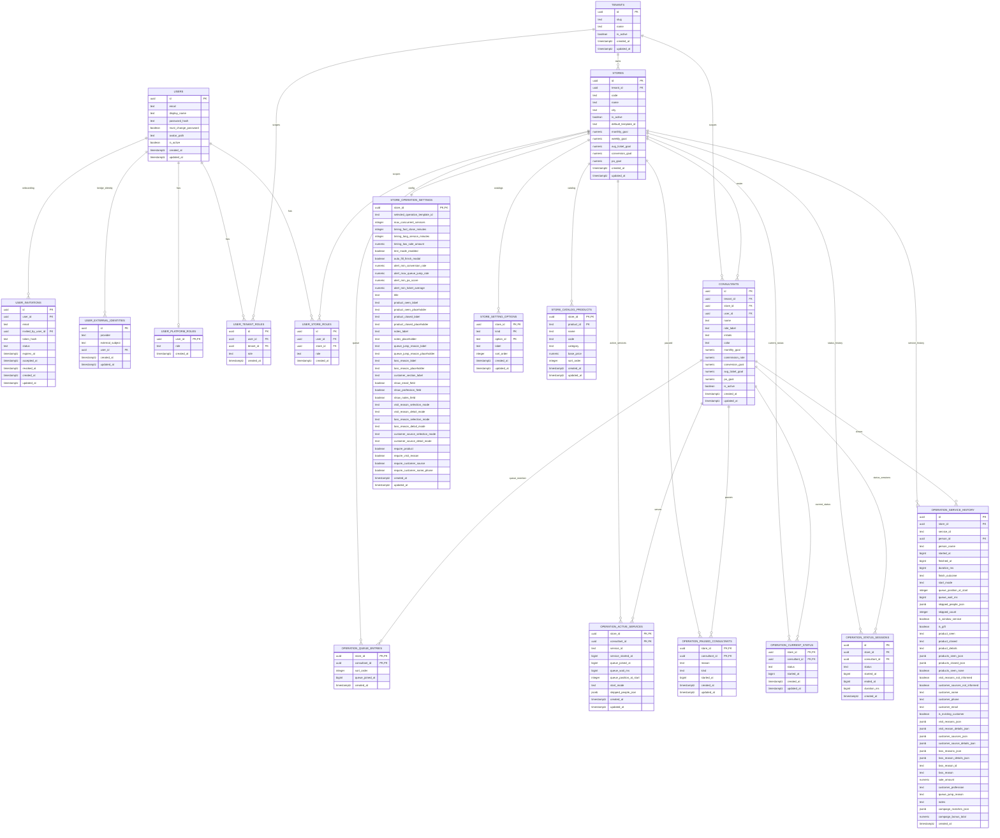

# ERD

## Visao atual do banco

## Leitura rapida

- `users`
  - identidade base da pessoa autenticada
  - `password_hash` pode nascer nulo durante onboarding por convite
  - `avatar_path` guarda apenas o caminho publico da foto; o arquivo vive no volume do backend
- `user_invitations`
- `users.must_change_password`
  - trilha de convite/onboarding e aceite inicial de senha
- `user_external_identities`
  - vínculo opcional entre identidade externa do shell e usuário local do módulo
  - usado para SSO/bridge sem amarrar o módulo ao banco do shell
- `tenants`
  - cliente/dono do grupo
- `stores`
  - lojas pertencentes a um tenant, incluindo template padrao e metas administrativas
- `user_platform_roles`
  - acesso interno de plataforma, hoje para `platform_admin`
- `user_tenant_roles`
  - papeis no escopo do tenant, hoje `marketing` e `owner`
- `user_store_roles`
  - papeis no escopo da loja, hoje `consultant`, `manager` e `store_terminal`
- `consultants`
  - roster administrativo por loja para a operacao
  - backlog aberto para vinculo 1:1 com `users`
- `store_operation_settings`
  - configuracao escalar da loja para a operacao e o modal
- `store_setting_options`
  - catalogos configuraveis da loja, tipados por `kind`
- `store_catalog_products`
  - catalogo de produtos configuravel da loja
- `operation_queue_entries`
  - fila corrente por loja
- `operation_active_services`
  - atendimentos em andamento
- `operation_paused_consultants`
  - pausas correntes por consultor
- `operation_current_status`
  - status atual resumido por consultor
- `operation_status_sessions`
  - trilha append-only das transicoes de status
- `operation_service_history`
  - historico append-only do fechamento operacional

## Seeds atuais

A migration de seed cria:

- `tenant-demo`
- 2 lojas demo
- 5 usuarios demo
- memberships coerentes com os papeis atuais do auth
- consultores demo para `Perola Riomar` e `Perola Jardins`

## Observacoes de modelagem

- `settings` deixou de viver em um JSON gigante e foi normalizado por tabela
- `operations` usa tabelas correntes para snapshot rapido e tabelas append-only para historico
- `reports` le o historico principalmente por `store_id` + `finished_at`, com indices dedicados para tempo, consultor e desfecho
- `user_invitations` guarda o token em hash, nunca o token aberto
- onboarding inicial funciona assim:
  - admin cria usuario sem senha
  - backend gera convite com expiracao
  - usuario aceita o convite e define a primeira senha
- alguns campos do historico continuam em `jsonb` por serem listas e mapas variaveis do fechamento, como:
  - `products_seen_json`
  - `products_closed_json`
  - `visit_reasons_json`
  - `visit_reason_details_json`
  - `customer_sources_json`
  - `customer_source_details_json`
  - `loss_reasons_json`
  - `loss_reason_details_json`
- para agregacao e filtros, o dado estruturado em `jsonb` deve ser tratado como fonte de verdade antes dos campos escalares legados
  - `campaign_matches_json`

## Proxima camada que deve entrar aqui

- websocket/outbox de eventos por loja
- campanhas server-side
- relatorios e analytics server-side
- endurecimento do modelo de identidade operacional:
  - consultor como conta real obrigatoria
  - terminal de loja como conta fixa read-only da unidade
  - futuras amarras de dispositivo/origem por loja
